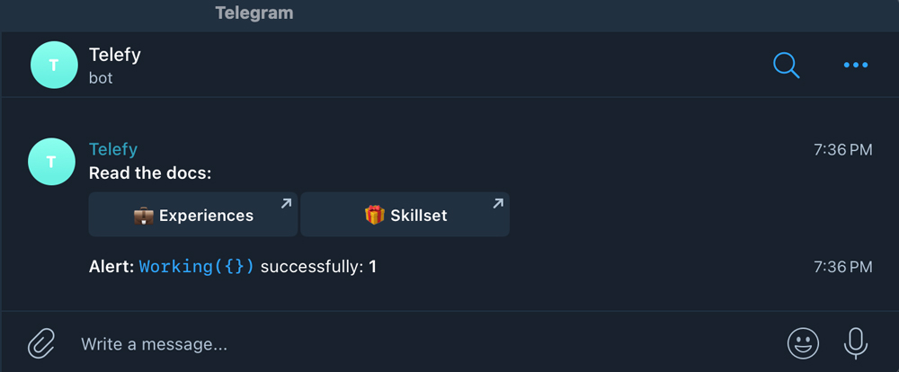
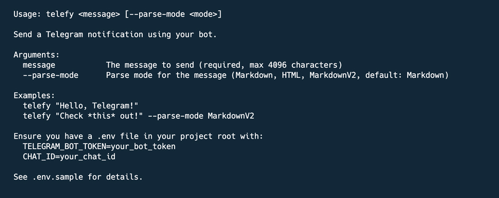
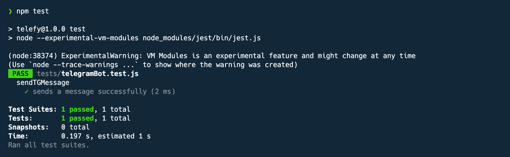

# Telefy

[](https://nodejs.org/)
[](https://github.com/shuvoaftab/npm-telefy/blob/main/LICENSE)
[](https://www.npmjs.com/package/telefy)

A simple but robust npm package to send Telegram notifications via a bot, with multi-channel support and CLI functionality for Node.js applications. Perfect for server notifications, alerts, and automated messages across different channels.

## Features

- 📤 **Simple API**: Easy-to-use functions for sending Telegram messages
- 🔘 **Inline Buttons**: Support for adding clickable inline URL buttons
- 📝 **Markdown Support**: Format messages with Markdown, HTML, or MarkdownV2
- 💻 **CLI Tool**: Send messages directly from your command line with intuitive options
- 🌐 **Multi-Channel Support**: Configure and send to multiple Telegram channels
- 📢 **Broadcast Mode**: Send to all configured channels at once with `--all` option
- 🚀 **Promise-based**: Modern async/await and Promise support
- 🛡️ **Error Handling**: Detailed error messages with helpful suggestions
- ⚙️ **Environment Variables**: Secure configuration using .env files
- 🎨 **Raw Mode**: Optional MarkdownV2 formatting without automatic escaping

## Prerequisites

Before using this package, you'll need:

1. A Telegram Bot Token (get one from [@BotFather](https://t.me/BotFather))
2. Your Chat ID (use [@userinfobot](https://t.me/userinfobot) or [@get_id_bot](https://t.me/get_id_bot))
3. Node.js version 18.0.0 or higher

## Installation

```bash
# Global installation for CLI usage
npm install -g telefy

# Local installation for programmatic use
npm install telefy
```

## Configuration

Create a `.env` file in your project root with one or more channel configurations:

```env
# Single channel configuration
CHANNEL_NEWS_TOKEN=your_bot_token_here
CHANNEL_NEWS_CHAT_ID=your_chat_id_here

# Multiple channel configuration
CHANNEL_ALERTS_TOKEN=another_bot_token_here
CHANNEL_ALERTS_CHAT_ID=another_chat_id_here
```

### Obtaining Telegram Credentials

1. **Bot Token**:
   - Open Telegram and message [@BotFather](https://t.me/BotFather)
   - Send `/start`, then `/newbot`
   - Follow the prompts to name your bot and receive a token

2. **Chat ID**:
   - Start a chat with your bot
   - Send a message to your bot
   - Visit `https://api.telegram.org/bot<YOUR_BOT_TOKEN>/getUpdates` in your browser
   - Find the chat ID in the JSON response under `"chat":{"id":<CHAT_ID>}`

## Usage

### As a Module

```javascript
// ES Module import
import { sendTGMessage, sendTGMessageWithButtons, getChannels } from 'telefy';

// Send a simple message to a specific channel
sendTGMessage('Hello from my application!', 'news')
  .then(results => console.log(`Message sent to ${results[0].channel}!`))
  .catch(err => console.error('Error:', err.message, err.suggestion));

// Send a message to all configured channels
sendTGMessage('Broadcast to all channels!', 'all')
  .then(results => results.forEach(r => console.log(`Sent to ${r.channel}`)))
  .catch(err => console.error('Error:', err.message, err.suggestion));

// Send a message with formatting (Markdown)
sendTGMessage('*Bold text* and _italic text_', 'alerts')
  .then(results => console.log('Formatted message sent!'))
  .catch(err => console.error('Error:', err.message, err.suggestion));

// Send a message with buttons
const buttons = [
  [
    { text: '📝 Documentation', url: 'https://example.com/docs' },
    { text: '💻 GitHub', url: 'https://github.com/shuvoaftab/npm-telefy' }
  ],
  [
    { text: '🌐 Website', url: 'https://ibrahimsharif.com' }
  ]
];

sendTGMessageWithButtons('Check out these links:', buttons, 'news')
  .then(results => console.log('Message with buttons sent!'))
  .catch(err => console.error('Error:', err.message, err.suggestion));

// Get all configured channels
const channels = getChannels();
console.log(`Available channels: ${[...channels.keys()].join(', ')}`);
```

### Using the CLI Tool

```bash
# Basic usage (uses the only channel if only one is configured)
telefy "Hello from CLI!"

# Send to a specific channel
telefy "Hello news channel!" --channel news

# Alternative channel syntax
telefy "Hello alerts channel!" --channel=alerts

# Send to all configured channels
telefy "Broadcast to all channels!" --all

# With Markdown formatting (default)
telefy "*Important* message with _formatting_"

# With HTML formatting
telefy "<b>Important</b> message with <i>formatting</i>" --parse-mode html

# With MarkdownV2 formatting (automatic escaping)
telefy "Check *this* out!" --parse-mode markdownv2

# With MarkdownV2 formatting (no escaping)
telefy "Check *this* out! Special chars: () [] ." --parse-mode markdownv2 --raw

# With inline buttons
telefy "Check this link:" --channel news --button "Visit Website|https://example.com"

# With multiple buttons
telefy "Useful links:" --channel alerts --button "Docs|https://docs.example.com" --button "Support|https://support.example.com"

# Show help
telefy --help
```

## API Reference

### sendTGMessage(text, channel, parseMode)

Sends a simple text message to one or all Telegram channels.

| Parameter | Type | Default | Description |
|-----------|------|---------|-------------|
| text | string | (required) | Message text (max 4096 characters) |
| channel | string | 'all' | Target channel name or 'all' for all channels |
| parseMode | string | 'Markdown' | Parse mode ('Markdown', 'HTML', 'MarkdownV2') |

Returns: Promise resolving to an array of objects with `{ channel, response }` data

### sendTGMessageWithButtons(text, buttons, channel, parseMode)

Sends a message with inline URL buttons to one or all Telegram channels.

| Parameter | Type | Default | Description |
|-----------|------|---------|-------------|
| text | string | (required) | Message text (max 4096 characters) |
| buttons | Array | [[]] | Array of button rows, each containing button objects with text and url properties |
| channel | string | 'all' | Target channel name or 'all' for all channels |
| parseMode | string | 'Markdown' | Parse mode ('Markdown', 'HTML', 'MarkdownV2') |

Returns: Promise resolving to an array of objects with `{ channel, response }` data

Button format:

```javascript
[
  [{ text: 'Button 1', url: 'https://example.com' }, { text: 'Button 2', url: 'https://example.org' }],
  [{ text: 'Button 3', url: 'https://example.net' }]
]
```

### getChannels()

Returns all configured channels from environment variables.

Returns: Map object with channel names as keys and configuration objects as values

```javascript
// Example usage
const channels = getChannels();
console.log(`Available channels: ${[...channels.keys()].join(', ')}`);
```

## CLI Options

```bash
telefy <message> [--channel <name> | --channel=<name> | --all] [--parse-mode <mode>] [--button <text|url>] [--raw]
```

| Option | Default | Description |
|--------|---------|-------------|
| `<message>` | (required) | The message to send (max 4096 characters) |
| `--channel <name>` | (auto) | Send to a specific channel |
| `--channel=<name>` | (auto) | Alternative syntax for specific channel |
| `--all` | - | Send to all configured channels |
| `--parse-mode <mode>` | markdown | Parse mode (markdown, html, markdownv2) |
| `--button <text\|url>` | - | Add an inline button (e.g., "Visit\|<https://ibrahimsharif.com">) |
| `--raw` | - | Disable automatic escaping for MarkdownV2 |
| `--help` | - | Show help information |

Note: If only one channel is configured, it will be used by default without needing `--channel`.

## Telegram Formatting

### Markdown (Default)

```markdown
*bold text*
_italic text_
`monospace`
[text](URL)
```

### HTML

```html
<b>bold text</b>
<i>italic text</i>
<code>monospace</code>
<a href="URL">text</a>
```

### MarkdownV2

```markdown
*bold text*
_italic text_
`monospace`
[text](URL)
```

Note: When using MarkdownV2, special characters (_*[]()~>#+=|{}.!) must be escaped with a backslash. In CLI mode, this happens automatically unless `--raw` is specified. In API mode, you must handle escaping manually.

## Error Handling

The package provides detailed error messages and suggestions for both the CLI and API:

### API Error Handling

```javascript
try {
  await sendTGMessage('Test message', 'invalid_channel');
} catch (error) {
  console.error(`Error: ${error.message}`);
  console.error(`Suggestion: ${error.suggestion}`);
  // Error: Channel "invalid_channel" not found
  // Suggestion: Available channels: news, alerts. Check your .env file.
}
```

### CLI Error Output

```bash
$ telefy "Test" --channel invalid_channel

Error: Channel "invalid_channel" not found
Suggestion: Available channels: news, alerts. Check your .env file.
```

## Integration Examples

### Example: Express.js Integration

```javascript
import express from 'express';
import { sendTGMessage } from 'telefy';

const app = express();
const port = 3000;

app.get('/', (req, res) => {
  res.send('Hello World!');
});

app.listen(port, async () => {
  console.log(`Server running on port ${port}`);
  
  // Send Telegram notification when server starts
  try {
    const results = await sendTGMessage(`🚀 *Server Started*\nThe application server is now running on port ${port}`, 'news');
    console.log(`Start notification sent to ${results[0].channel}`);
  } catch (err) {
    console.error('Failed to send notification:', err.message, err.suggestion);
  }
});

// Error notification middleware
app.use((err, req, res, next) => {
  sendTGMessage(`❌ *Error Detected*\n\`\`\`\n${err.stack}\n\`\`\``, 'alerts')
    .catch(console.error);
  
  res.status(500).send('Something broke!');
});
```

### Example: Cron Job Integration

Schedule Telefy commands in a cron job for automated notifications:

```bash
# Edit crontab
crontab -e

# Add a job (e.g., send every hour)
0 * * * * /path/to/node /path/to/telefy "Hourly status: All systems OK" --channel=news
```

Ensure the cron environment has access to node, the telefy package, and the .env file. Alternatively, set environment variables directly in the cron job:

```bash
0 * * * * CHANNEL_NEWS_TOKEN=your_token CHANNEL_NEWS_CHAT_ID=your_chat_id /path/to/node /path/to/telefy "Hourly status" --channel=news
```

## Use Cases

- **Server Monitoring**: Send notifications about server uptime, downtime, or resource usage
- **Application Alerts**: Notify team members about critical application events
- **Deployment Updates**: Inform team when deployments succeed or fail
- **Cron Job Results**: Report results of scheduled tasks
- **Error Reporting**: Send detailed error logs to your support team
- **Database Backups**: Confirm successful backups or report failures
- **User Registration**: Notify admins about new user registrations
- **Order Processing**: Send updates about order status changes
- **Multi-Team Notifications**: Route different types of alerts to different channels
- **Broadcast Announcements**: Send important messages to all configured channels

## Running Tests

```bash
npm run test
```

Tests use Jest and cover API functionality, including error handling and multi-channel support.

## Screenshots

Here are some screenshots showcasing the usage of **telefy**:

### Sending a Message



### CLI Help Command



### Run Test



## Contributing

Contributions are welcome! Please feel free to submit a Pull Request.

1. Fork the repository (`git clone https://github.com/shuvoaftab/npm-telefy.git`)
2. Create your feature branch (`git checkout -b feature/amazing-feature`)
3. Commit your changes (`git commit -m 'Add some amazing feature'`)
4. Push to the branch (`git push origin feature/amazing-feature`)
5. Open a Pull Request

Please include tests and update documentation as needed.

## License

This project is licensed under the MIT License - see the LICENSE file for details.

## Author

Ibrahim Sharif - [Website](https://ibrahimsharif.com)

## Acknowledgements

- [Telegram Bot API](https://core.telegram.org/bots/api)
- [Axios](https://axios-http.com/)
- [dotenv](https://github.com/motdotla/dotenv)
- [Jest](https://jestjs.io)
